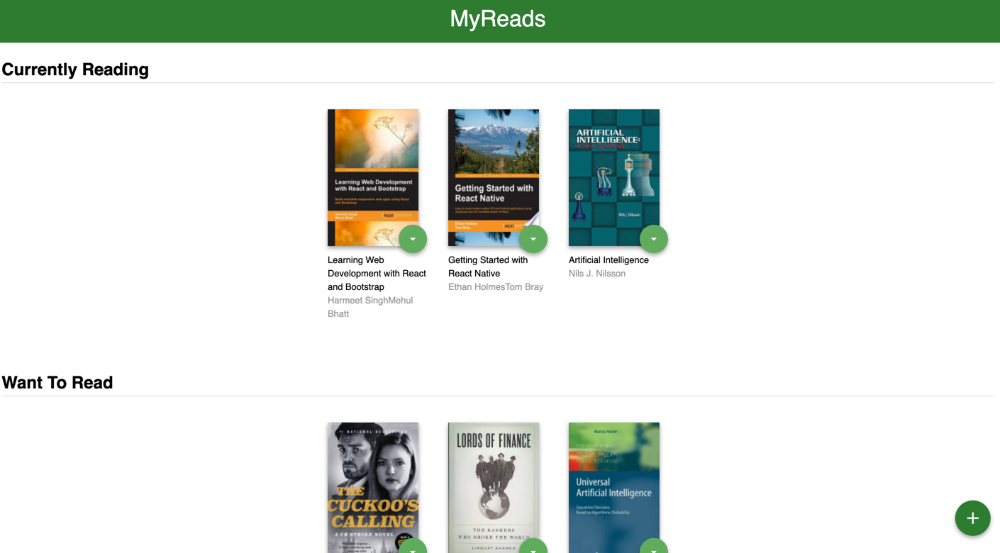
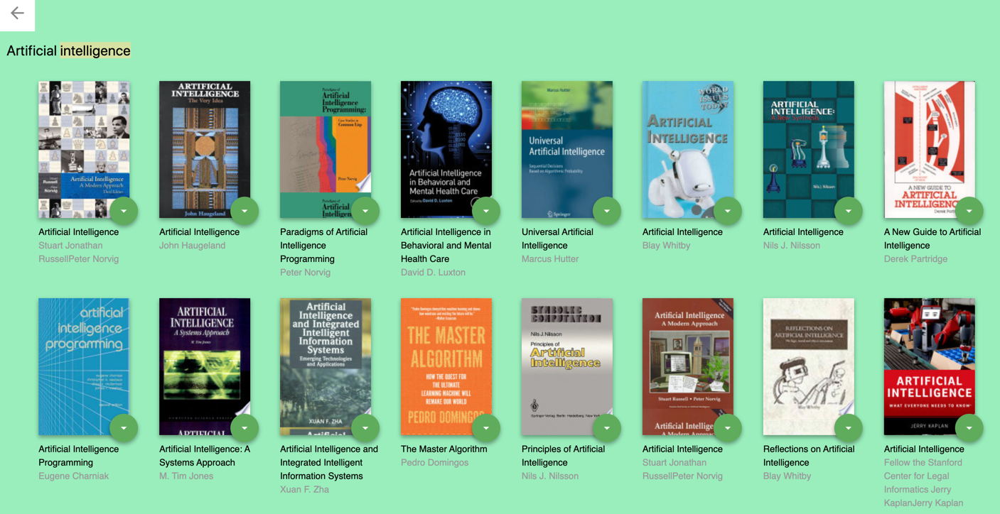

# MyReads App - Project

My Reads application - Udacity Nanodegree program first project. Its consist's a book library in which users can add books to their collection from three different books shelves thats available shelf : Currently reading, Want to Read, Read. Books can moved from one shelf to another shelf. 
Every books is displayed with its their cover, title and author thats users allow to move the book to their shelf choose.

## Installation

Upload the repositary:  
   - git clone https://github.com/SumaPrajapati/reactnd_MyReadsApp.git  
   - cd reactnd_MyReadsApp  
   - Run `npm install` for install all dependencies  
   - Run `npm start`  
   - The projects run on the default browser: [http://localhost:3000](http://localhost:3000) to view the application in this browser 

## Main Page

The Main page display 3 book shelves. Each shelf books thats belong to that shelf and based on the user choice to move one shelf to another shelf.

## Search Page

The search book page find any book from input field. This screen shown up aleast 17 books at time.  
If users want select a book to their choice based on shelf: Currently Reading, Want to Read and Read. Then book shown up in the main page belong their selected shelf. 

